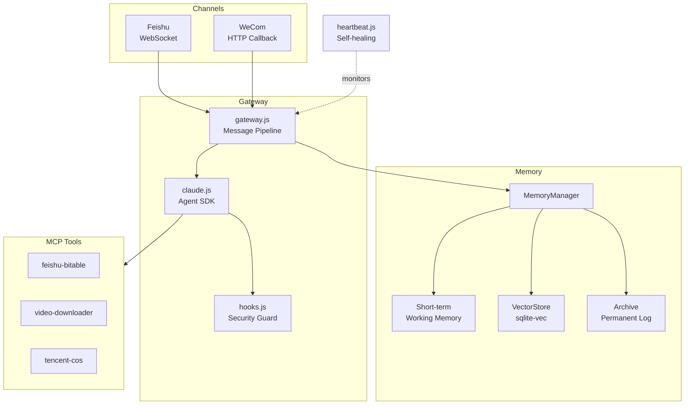

# OpenMist

[](LICENSE)

English | [中文](README.md)

> **Cut through the mist, get to the essence.**

A Claude Agent SDK gateway running in production. Talks to users through Feishu (Lark) and WeCom. Has memory, security hooks, and self-healing.

This started with a simple need: an AI assistant on Feishu that remembers context, can use tools, and fixes itself when things break. Nothing off-the-shelf did this, so I built it.

---

## Why this exists

The Claude Agent SDK is powerful, but official docs stop at Hello World. The real production problems — preventing Claude from running dangerous commands, making it remember last week's conversation, auto-recovering when services crash — have no reference implementations.

OpenMist is that reference implementation. Not a demo. A system that runs every day.

---

## What it does

**Security guard (hooks.js)**

Claude can execute arbitrary shell commands. The PreToolUse hook intercepts before execution: `rm -rf`, reading `.env`, `sudo su` — blocked at code level, not prompt level. AI can't bypass it. File writes go through path whitelisting. All tool calls are logged to an append-only audit trail.

**Memory system (memory/)**

Three layers: working memory (in-process JSON), vector search (DashScope + sqlite-vec), permanent archive. Queries use 70% semantic + 30% keyword hybrid search. Conversations are auto-summarized on session end. Relevant history is injected into the next conversation.

**Multi-channel gateway (channels/)**

The gateway handles memory injection, session management, and media — platform-agnostic. Feishu uses WebSocket, WeCom uses HTTP callbacks. Adding a new platform means writing one adapter class.

**Self-healing (heartbeat.js)**

Runs every 30 minutes. Native checks first (kill orphan processes, fix file permissions, verify VectorStore writability), then Claude analyzes logs and system state. Failed cron jobs get re-run automatically. Disk filling up gets cleaned. Not just alerting — fixing.

---

## Architecture



---

## Quick Start

### Prerequisites

- Node.js >= 18
- [Claude Code CLI](https://github.com/anthropics/claude-code) (Agent SDK runtime dependency)
- SQLite3
- Anthropic API key
- Feishu app credentials (App ID + App Secret)

### Install

```bash
npm install -g @anthropic-ai/claude-code

git clone https://github.com/chituhouse/open-mist.git
cd open-mist
npm install
```

### Configure

```bash
cp .env.example .env
```

Required:

| Variable | Description |
|----------|-------------|
| `ANTHROPIC_API_KEY` | Anthropic API key |
| `CLAUDE_MODEL` | Model ID, default `claude-opus-4-6` |
| `FEISHU_APP_ID` | Feishu app ID |
| `FEISHU_APP_SECRET` | Feishu app secret |

Optional:

| Variable | Description |
|----------|-------------|
| `ANTHROPIC_BASE_URL` | API endpoint, default `https://api.anthropic.com` |
| `DASHSCOPE_API_KEY` | Alibaba DashScope (vector embeddings) |
| `WECOM_CORP_ID` | WeCom corp ID (enables WeCom channel) |
| `COS_SECRET_ID` / `COS_SECRET_KEY` | Tencent Cloud COS (object storage) |

### Run

```bash
npm start
```

For production, use systemd:

```bash
sudo systemctl enable --now feishu-bot.service
```

---

## Project Structure

```
src/
  index.js              # Entry point, 40 lines
  gateway.js            # Message pipeline: memory retrieval -> Claude -> tracking
  claude.js             # Agent SDK wrapper + MCP config
  hooks.js              # Security: command filtering + path whitelisting + audit log
  session.js            # Session management
  channels/
    base.js             # Channel adapter base class
    feishu.js           # Feishu adapter
    wecom.js            # WeCom adapter
  memory/
    memory-manager.js   # Memory orchestrator: retrieve -> merge -> inject
    short-term.js       # Working memory (keyword matching)
    vector-store.js     # Vector search (DashScope + sqlite-vec)
    metrics.js          # Memory metrics
  heartbeat.js          # Self-healing daemon
  deployer.js           # Auto subdomain deployment (nginx)
  mcp-*.mjs             # MCP tool servers
agents/                 # Recommendation engine (optional business module)
scripts/                # Ops scripts
```

---

## MCP Tools

| Tool | File | Purpose |
|------|------|---------|
| feishu-bitable | `src/mcp-bitable.mjs` | Read/write Feishu Bitable records |
| video-downloader | `src/mcp-video.mjs` | Download videos (YouTube, Bilibili, etc.) |
| tencent-cos | `src/mcp-cos.mjs` | Tencent Cloud object storage |

MCP servers are spawned automatically by the Claude client. No separate setup needed.

---

## Contributing

PRs welcome. One thing per PR. Test before submitting.

---

## License

[MIT](LICENSE)
