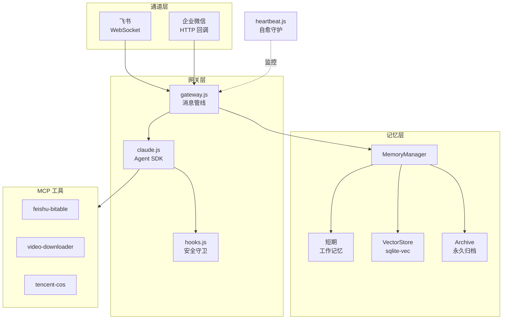

# OpenMist

[](LICENSE)

[English](README.en.md) | 中文

> **破雾寻光** — 穿越迷雾，直抵本质。

一个跑在生产环境的 Claude Agent SDK 网关。通过飞书和企业微信与用户对话，具备记忆、安全防护和自愈能力。

这个项目始于一个简单的需求：在飞书上有一个能记住上下文、能调工具、出了问题能自己修的 AI 助手。找了一圈没有现成方案，就自己写了。

---

## 这个项目解决什么问题

Claude Agent SDK 功能强大，但官方文档止步于 Hello World。真正跑在生产环境要解决的问题——怎么防止 AI 执行危险命令、怎么让它记住上周的对话、服务挂了怎么自动恢复——没有参考实现。

OpenMist 就是这个参考实现。不是 demo，是每天在用的系统。

### 起源

这个项目的诞生源于一次技术调研。当时在评估 [OpenClaw](https://github.com/openclaw/openclaw)（237K Stars 的通用 AI 助手框架），发现其架构天然存在安全隐患：CVE-2026-25253（RCE，CVSS 8.8）暴露了框架级的远程代码执行风险，社区 Skills 生态也存在供应链攻击面。

深入研究后发现一个事实：OpenClaw 的 12 项核心机制——安全沙箱、记忆系统、自愈、工具集成、Skills、Hooks、多 Agent 协作、多通道、知识管理、密钥管理、部署——都能用 Claude Code 的官方能力实现，不需要引入一个庞大的第三方框架。

于是就有了 OpenMist：**20 个文件、8 个依赖**，实现了对标 24+ 平台框架的核心能力。核心理念很简单——官方能做的用官方，自建只做官方没有的。

---

## 它做了什么

**安全守卫（hooks.js）**

Claude 有能力执行任意 shell 命令。PreToolUse Hook 在命令执行前拦截：`rm -rf`、读取 `.env`、`sudo su` 这类操作直接拒绝，不走提示词约束，代码级硬拦截，AI 绕不过去。写文件也有路径白名单。所有工具调用写入审计日志。

**记忆系统（memory/）**

三层：工作记忆（进程内 JSON）、向量检索（DashScope + sqlite-vec）、永久归档。查询时 70% 语义 + 30% 关键词混合检索。对话结束自动摘要入库。下次对话时，相关的历史上下文会自动注入。

**多通道网关（channels/）**

网关层处理记忆注入、会话管理、媒体文件，与平台无关。飞书走 WebSocket 长连接，企微走 HTTP 回调。加新平台就是写一个适配器类。

**自愈（heartbeat.js）**

每 30 分钟跑一轮检查。先跑原生检查（清孤儿进程、修文件权限、检测向量库可写性），再让 Claude 分析日志和系统状态。发现 cron 任务失败会自动重跑，磁盘快满会自动清理。不只是告警，是修复。

---

## 架构



---

## 快速开始

### 前置依赖

- Node.js >= 18
- [Claude Code CLI](https://github.com/anthropics/claude-code)（Agent SDK 运行时依赖）
- SQLite3
- Anthropic API Key
- 飞书应用凭证（App ID + App Secret）

### 安装

```bash
npm install -g @anthropic-ai/claude-code

git clone https://github.com/chituhouse/open-mist.git
cd open-mist
npm install
```

### 配置

```bash
cp .env.example .env
```

必填：

| 变量 | 说明 |
|------|------|
| `ANTHROPIC_API_KEY` | Anthropic API Key |
| `CLAUDE_MODEL` | 模型 ID，默认 `claude-opus-4-6` |
| `FEISHU_APP_ID` | 飞书应用 ID |
| `FEISHU_APP_SECRET` | 飞书应用密钥 |

可选：

| 变量 | 说明 |
|------|------|
| `ANTHROPIC_BASE_URL` | API 端点，默认 `https://api.anthropic.com` |
| `DASHSCOPE_API_KEY` | 阿里云 DashScope（向量 embedding） |
| `WECOM_CORP_ID` | 企微企业 ID（启用企微通道） |
| `COS_SECRET_ID` / `COS_SECRET_KEY` | 腾讯云 COS（对象存储） |

### 启动

```bash
npm start
```

生产环境用 systemd：

```bash
sudo systemctl enable --now feishu-bot.service
```

---

## 项目结构

```
src/
  index.js              # 入口，40 行
  gateway.js            # 消息管线：记忆检索 → Claude → 追踪
  claude.js             # Agent SDK 封装 + MCP 配置
  hooks.js              # 安全守卫：命令拦截 + 路径白名单 + 审计日志
  session.js            # 会话管理
  channels/
    base.js             # 通道适配器基类
    feishu.js           # 飞书适配器
    wecom.js            # 企微适配器
  memory/
    memory-manager.js   # 记忆编排：检索 → 合并 → 注入
    short-term.js       # 工作记忆（关键词匹配）
    vector-store.js     # 向量检索（DashScope + sqlite-vec）
    metrics.js          # 记忆指标
  heartbeat.js          # 自愈守护进程
  deployer.js           # nginx 子域名自动部署
  mcp-*.mjs             # MCP 工具服务器
agents/                 # 推荐引擎（可选的业务模块）
scripts/                # 运维脚本
```

---

## MCP 工具

| 工具 | 文件 | 用途 |
|------|------|------|
| feishu-bitable | `src/mcp-bitable.mjs` | 读写飞书多维表格 |
| video-downloader | `src/mcp-video.mjs` | 下载视频（YouTube、B站等） |
| tencent-cos | `src/mcp-cos.mjs` | 腾讯云对象存储 |

Claude 客户端自动启动这些 MCP 服务器，不需要单独配置。

---

## 贡献

欢迎 PR。一个 PR 做一件事，提交前跑通测试。

---

## 许可证

[MIT](LICENSE)
